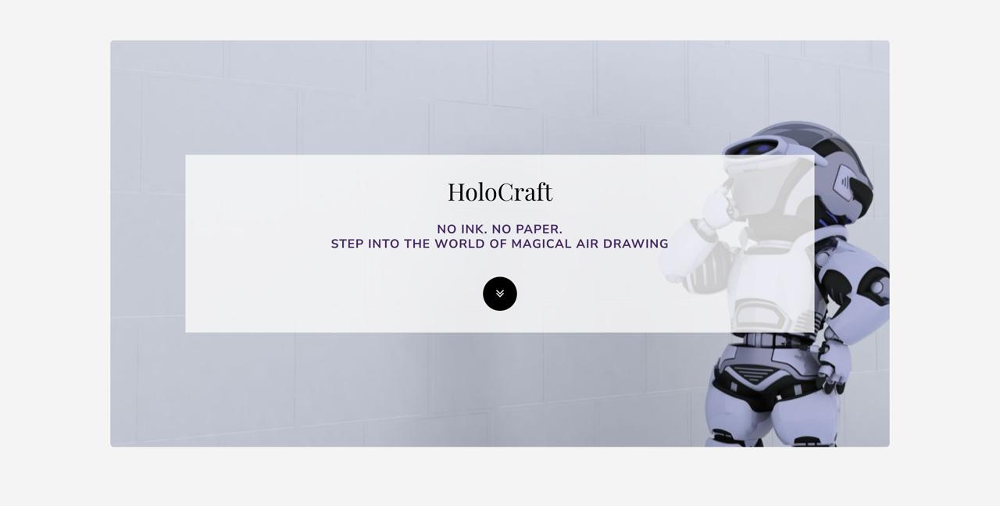
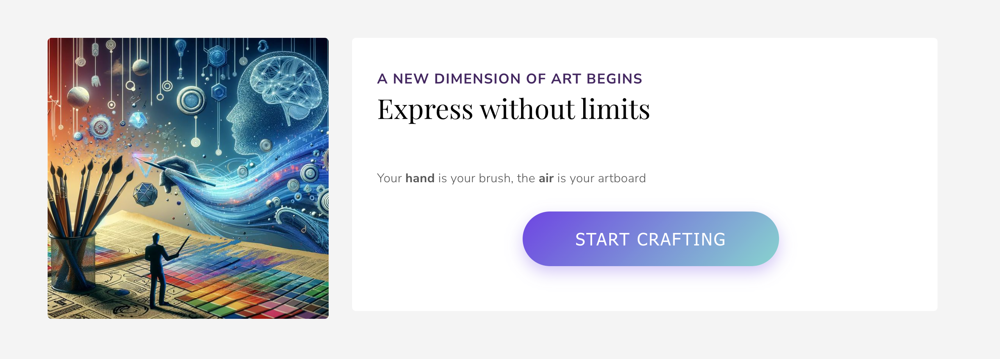

# HoloCraft - Air Drawing Web App

  

## Overview
A fully web-based application that lets you draw in the air using just your hand and webcam.

## Features 

### Control Modes
- **Drawing mode**: Pinch thumb and index finger 👌
- **Erasing mode**: Show peace sign ✌️
- **Change Color**: Point upward 👆

### Visual Interface
- Full-screen drawing area
- Live hand tracking display
- Color selector with cursor feedback

## How It Works
1. **Tracks** your hand using MediaPipe (21 landmarks)
2. **Recognizes** your gestures in real-time
3. **Smooths movements** (using 0.36 smoothing factor for fluid drawing)  
4. **Translates** movements to digital art

## Project Structure

### Landing Page (`index.html` + template assets)
A static page just for showcasing the project visually. It does not contain any drawing or gesture logic.

### Core Drawing App
- `app.js` → All gesture recognition and drawing logic  
- `app.html` → The actual drawing interface with canvas and video stream.
- `app.css` → Styling for the drawing environment.

  
## Setup
1. Clone the repository
2. Open `index.html` in Chrome/Firefox
3. Click "Start Crafting"
   

  

4. Allow camera access

> **Note:** Wait a few seconds for your hand landmarks to be detected.  
> You'll see your hand landmarks appear on screen when it's ready.

5. Start drawing in the air!

